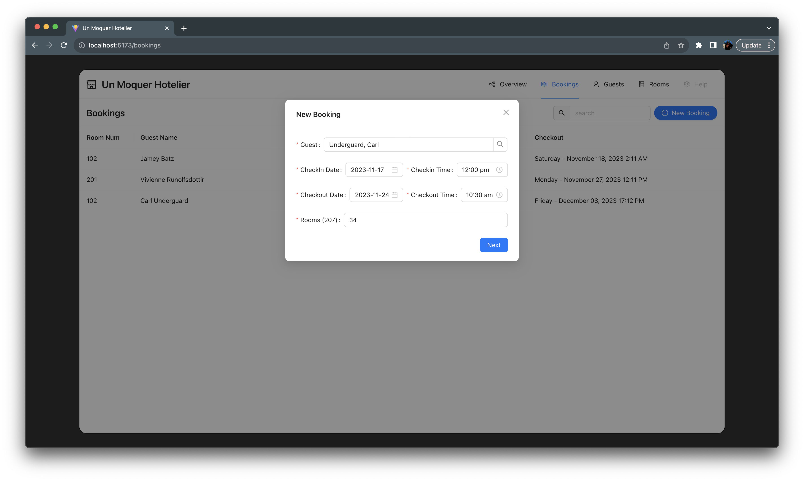

# Un Moquer Hotelier

A comprehensive hotel booking, guest, and room management system built with React.

This repo is the front-end layer only and is not intended to be used by the public. This is simply a showcase of front-end architecture, bleeding-edge technologies, and general best practices.


[See More UI Screenshots](#ui-screenshots)

## Tooling List

- [Yarn](https://yarnpkg.com/) - Package Manager
- [Vite](https://vitejs.dev/) - Front End Build Tool
- [React](https://react.dev/) - Front End Composition
- [React Router](https://github.com/remix-run/react-router#readme) - SPA Router
- [React Query](https://tanstack.com/query/v4/docs/react/overview) - Data Fetching
- [React Testing Library](https://testing-library.com/) - React Testing
- [Vitest](https://vitest.dev/) - Unit Testing
- [Ant Design](https://ant.design/) - React UI Component Library
- [Tailwind](https://tailwindcss.com/) - CSS Framework
- [DayJS](https://day.js.org/) - Date Formatting

## API Layer & Data Storage

- Next.js API Hosted on Vercel
- MongoDB Atlas for data storage


## Techniques & Decisions

### Code Style

- All function-based components (no class based)
  - Functional components have a simpler syntax, no lifecycle methods, constructors or boilerplate. You can express the same logic with less characters without losing readability.
- Avoid inline styles whenever possible.
  - Use tailwind classes, extend tailwind theme (`tailwind.config.js`), or leverage Ant Design theme provider customizations.
- Naming and structure should suffice in lieu of commenting in _most_ cases.
- To achieve consistent component naming conventions, only use named component exports, no defaults.
- Leverage React Query based custom hooks instead of kicking off HTTP requests within components.

### Patterns

- Not importing React `import React from 'react'`
  - As of React v17, you no longer have to include dependency to transform JSX
- Absolute Dependency Paths (`'src/'`)
- Spread Syntax
  - e.g. `<BookingConfirmation {...bookingDetails} />`
- Conditional Rendering
  - e.g. (`{ dataIsAvailable && <ComponentToShow /> }`)
- ContextAPI
  - Used to avoid ugly prop drilling managing New Booking modal states
- Loading State Pattern
  - Toggle `isLoading` state variables during processes.
  - Disable form fields and buttons during API calls to avoid duplicate calls.
- Destructuring with Aliasing
  - e.g. ` const { mutate: addGuest } = useCreateGuest()`
- Container Parent / Presentation Child Pattern (smart parent / dumb children)
  - All core features exhibit this pattern (Overview, Bookings, Guests, Rooms, and Settings)
- Custom Hooks
  - Only use Higher Order Components (HOC) or Render Props when absolutely necessary.
- `<ErrorBoundary />`
  - Prevent intrusive errors from affecting entire app.

## API Gateway

An exclusive channel for transmitting requests.

module: [src/api/API.js](src/api/API.js)

All API requests converge here where they are processed and dispatched.

### Features

- Standardized method for handling requests.
- Authorization key passed for every call.
- Mechanism for assembling query strings.
- Converts response to JSON.
- Success and error handling
- DRY. No new features need dedicated api handlers.

sample config object passed into module

```
API.call( {
  method: 'GET',
  endpoint: '/guests',
  id: 652a002a84fd6cdd03be4d0f,
  payload: {
    checkinDate: 2023-12-10T15:30:00.000Z,
    checkoutDate: 2023-12-17T15:30:00.000Z,
  }
} )
```

gets transformed into an api ready uri prior to fetch invocation

```
/guests?checkinDate=2023-12-10T15:30:00.000Z&checkoutDate=2023-12-17T15:30:00.000Z&id=652a002a84fd6cdd03be4d0f`
```

**NOTE:** GET requests with a passed in "payload" are transformed into query strings. POST and PUT requests with payloads are sent through the body of the request as they normally would.

Must include, at minimum, a `method` and `endpoint`. This would presumably be a GET request for all records from the endpoint.

If the aforementioned minimum required arguments are passed in alongside an `id`, it's assumed you'll be requesting or deleting a single record - depending on the method passed in.

### Available API Path Endpoints

`src/api/constants.js`

```
bookings: "/bookings",
bookingsByRoom: "/bookingsByRoom",
guests: "/guests",
guest: "/getOneGuest",
autocompleteGuests: "/getGuestsForAutocomplete",
rooms: "/rooms",
occupiedRooms: "/getCurrentlyOccupiedRooms",
roomByAvailability: "/getRoomsByAvailability",
settings: "/settings",
```

## HTTP Flow


## Component Diagrams

### New Booking Form


## Component Hierarchy

TBD

## UI Screenshots

### Guest Table


### Guest Detail


### New Guest Form


### Bookings Table


### Booking Detail


### New Booking Form



### Booking Confirmation


```

```
