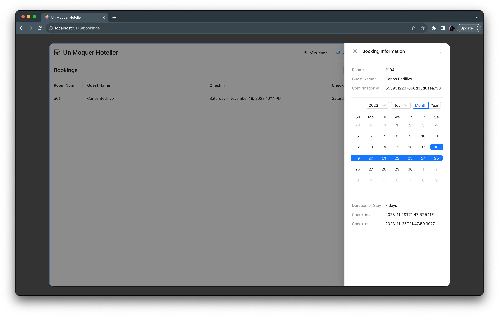

# Un Moquer Hotelier

A mock hotel booking and guest management system built with the MERN stack. The idea is to continue implementing advanced concepts through out the tech stacks by building a custom content management system.

This repo is the front-end layer only.

[See More UI Screenshots](#ui-screenshots)

## Tooling List

- Package Manager - [Yarn](https://yarnpkg.com/)
- Front End Build Tool - [Vite](https://vitejs.dev/)
- Front End Framework - [React](https://react.dev/)
- SPA Router - [React Router](https://github.com/remix-run/react-router#readme)
- UI Kit - [Ant Design](https://ant.design/)
- Unit Testing - [Vitest](https://vitest.dev/)

## API Layer & Data Storage

- Next.js API Hosted on Vercel
- MongoDB Atlas for data storage

## Techniques

- All function-based components (no class based)
  - Functional components have a simpler syntax, no lifecycle methods, constructors or boilerplate. You can express the same logic with less characters without losing readability.
- Conditional Rendering
- ContextAPI
  - Used to avoid ugly prop drilling with New Booking modal states
- isLoading toggle before/after API calls
  - Indicates to user a process is occurring and avoids duplicate calls.
- Disabling form fields and buttons during API calls
    - Indicates to user a process is occurring and avoids duplicate calls.
- Spread Syntax
- Destructuring
- Smart parent / dumb children pattern
- Custom Hooks
  - Only use Higher Order Components (HOC) or Render Props when absolutely necessary.
- `<ErrorBoundary />` to prevent intrusive errors

## Component Diagrams

### New Booking Form

## Component Hierarchy

TBD

## UI Screenshots

### Guest Table

### Guest Detail

### New Guest Form

### Bookings Table

### Booking Detail

### New Booking Form

### Booking Confirmation
